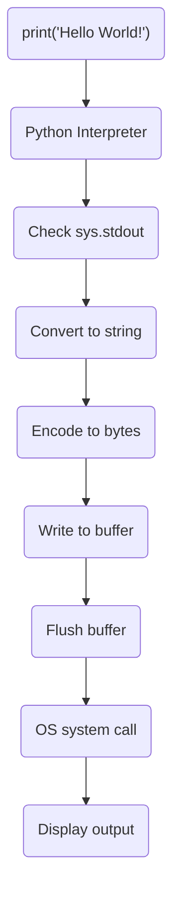
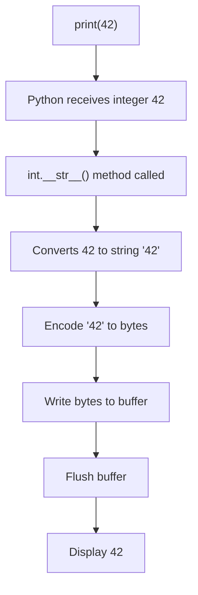

## Internal workings of print("Hello World!") in Python

- You call print("Hello World!")
- The Python interpreter receives this command
- Python checks if sys.stdout is available
- The text is converted to a string if it isn't already
- The string is encoded to bytes (usually UTF-8)
- The bytes are written to a buffer
- The buffer is flushed (due to automatic newline)
- The operating system receives the write command
- The text appears on your screen

### A flow chart to explain the internal workings of print("Hello World!") in Python.


### Text to String Conversion:
- When you pass an object to print(), Python needs it in string form
```
# 1. If already a string, no conversion needed
print("Hello")  # Already a string

# 2. For other types, Python calls __str__ method
```

#### Integer to String Conversion Example:



### String to Bytes Encoding (UTF-8):
- Computers can only work with bytes (1s and 0s)
- String encoding converts characters to their byte representation
  
### Bytes are written to a buffer:
- A buffer is a temporary memory storage area
- Instead of writing each character directly to the screen/file one at a time, Python first collects them in this buffer
- This buffering process improves performance because:
    - Writing to output devices (screen/file) is relatively slow
    - Grouping multiple writes together is more efficient than individual writes
    - It reduces system calls to the operating system

### Buffer is flushed (due to automatic newline):
- "Flushing" means the content in the buffer is actually written to the output device
- The print() function automatically adds a newline character ('\n') by default
- When Python sees a newline character, it triggers a buffer flush
- You can control this behavior in print():
```
# Without flush
for i in range(5):
    print("Processing...", end='')
    # Output might not appear immediately
    # Stays in buffer until newline or buffer is full

# With flush
for i in range(5):
    print("Processing...", end='', flush=True)
    # Output appears immediately after each print
```

### This buffering mechanism is particularly important when:

1. Writing logs to files
2. Displaying real-time progress updates
3. Debugging programs where timing matters
4. Writing to pipes or network connections
  
