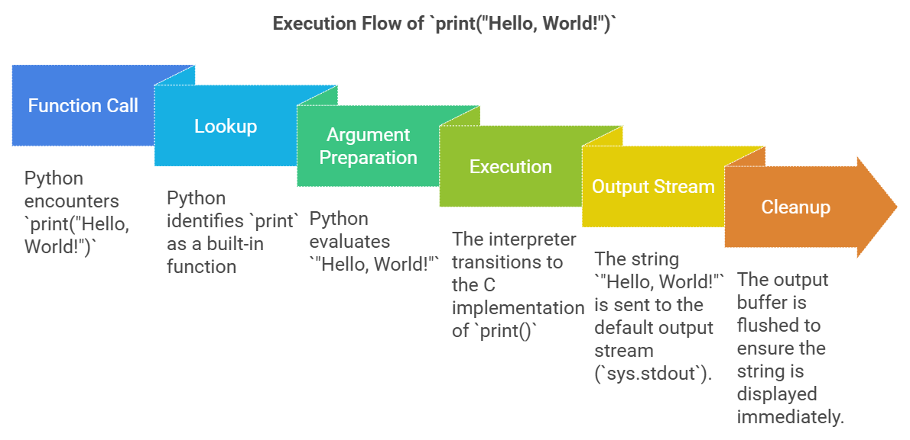
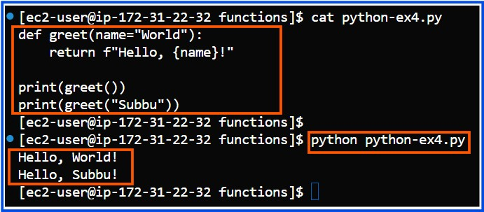
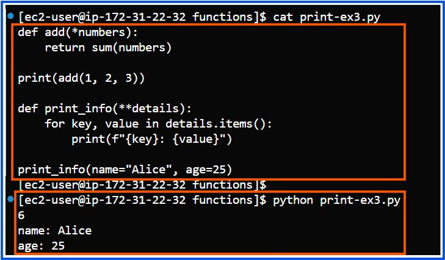

## Understanding Functions in Python
  ### Functions in Python are blocks of reusable code designed to perform a specific task. 
  #### Types of Functions:
**1. Built-in Functions:** These are pre-defined functions that come with Python.

**Examples:**
  - **print():** Displays output to the console.
  - **len():** Returns the length of a string, list, etc.
  - **sum():** Adds all elements in an iterable.

**Example:**
```python
numbers = [1, 2, 3]
print(len(numbers))  # Output: 3
```

**2. User-defined Functions:** These are functions that you create yourself to perform specific tasks.

**Syntax:**

```python
def function_name(parameters):
    # code block
    return result
```

**Example:**

```python
def greet(name):
    return f"Hello, {name}!"
print(greet("Subbu"))  # Output: Hello, Subbu!
```
**3. Functions from Modules:** Python allows you to import functions from external modules or libraries. 

**Example:**
```python
import math
print(math.sqrt(16))  # Output: 4.0
```
---
### Internal Flow of Function Execution in Python for the `print()` Function:

  **1. Function Call:** Python encounters print("Hello, World!").
  
  **2. Lookup:** Python identifies print as a built-in function.
  
  **3. Argument Preparation:**
  
  - Python evaluates "Hello, World!".
    
  **4. Execution:**
  
  - The interpreter transitions to the C implementation of print().
  - The string "Hello, World!" is sent to the default output stream (sys.stdout).
    
  **5. Cleanup:** The output buffer is flushed to ensure the string is displayed immediately.
  
  **6. Return:** The function completes and returns None.
  
  
--- 

  
### Complete Flow Diagram of print("Hello, World!"):
   
   
   

   ---
### Optional Arguments in print()
**1. sep (Separator):**
**Syntax:**
```python
print(*objects, sep='separator')
```
**Example:**
```python
print("Hello", "World", sep="-")
# Output: Hello-World
```
**2. end (End Character):**
**Syntax:**
```python
print(*objects, end='end_character')
```
**Example:**
```python
print("Hello", end="!!!")
print("World")
# Output: Hello!!!World
```
**3. file (Output Stream):**
**Syntax:**
```python
print(*objects, file=stream)
```
**Example:**
```python
with open("output.txt", "w") as f:
    print("Hello, Subbu!", file=f)
# The text "Hello, Subbu!" is written to `output.txt`.
```

- open: Built-in Python function -> Opens the file (output.txt) in the specified mode (w).

- "w": File mode -> Opens the file for writing (creates or overwrites the file).

- with: Context manager -> Ensures proper cleanup (file is closed automatically).

- as: Assigns the file object returned by open() to the variable (f).

- f: File object -> Used to interact with the file (e.g., write to it).
  
**What Happens with the above code:**
1. The file output.txt is opened (created or overwritten if it already exists).
2. The text "Hello, File!" is written to the file.
3. The file is closed automatically.

#### If you do not use the with statement, you need to explicitly close the file after writing to it using the close() method. Here’s how you can do it:

```python
# Open the file in write mode
f = open("output.txt", "w")

# Write to the file
print("Hello, File!", file=f)

# Close the file
f.close()

```
----

### How Functions Work (Step-by-Step):

**Define:** The function is created with the **def** keyword.

**Call:** The function is executed by calling it with its name and providing any necessary arguments.

**Process:** The code block inside the function runs.

**Return:** If there is a **return** statement, the function sends back a value. If not, it returns **None**.


---

### Key Concepts of Functions:
**1. Function Definition:** Use the **def** keyword to define a function.

**Example:**
```python
def add_numbers(a, b):
    return a + b
``` 
**2. Function Parameters and Arguments:** 
- **Parameters:** Placeholders in the function definition.
- **Arguments:** Actual values passed when calling the function.

**Example:**
```python
def greet(name):  # 'name' is the parameter
    return f"Hello, {name}!"

greet("Subbu")  # 'Subbu' is the argument
```

**3. Return Statement:** Use **return** to send a result back to the caller. If return is not used, the function returns **None**.
**Example:**
```python
def square(x):
    return x ** 2

print(square(4))  # Output: 16
```
**4. Default Parameters:** Functions can have default values for parameters.

**Example:**
```python
def greet(name="World"):
    return f"Hello, {name}!"

print(greet())          # Output: Hello, World!
print(greet("Subbu"))   # Output: Hello, Subbu!
```


**5. Variable-Length Arguments:** 
- Use ***args** to accept multiple positional arguments.
- Use ****kwargs** to accept multiple keyword arguments.
  
**Example:** 
```python
def add(*numbers):
    return sum(numbers)

print(add(1, 2, 3))  # Output: 6

def print_info(**details):
    for key, value in details.items():
        print(f"{key}: {value}")

print_info(name="Alice", age=25)
```
**f"{key}: {value}":** f-strings (formatted string literals)

**Purpose꞉** Lets users put variables and expressions inside strings for easier formatting.

**Note:** **File f** is useful for various purposes. It is a variable that represents a file object in file operations.




-----
