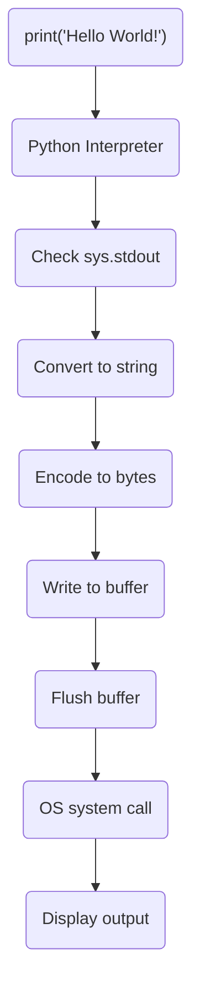

## Internal workings of print("Hello World!") in Python

## You call print("Hello World!")
The Python interpreter receives this command
Python checks if sys.stdout is available
The text is converted to a string if it isn't already
The string is encoded to bytes (usually UTF-8)
The bytes are written to a buffer
The buffer is flushed (due to automatic newline)
The operating system receives the write command
The text appears on your screen

### A flow chart to explain the internal workings of print("Hello World!") in Python.

